# Outline

1. Neurocomputational models

2. Neuro-simulator ANNarchy

3. Rate-coded networks

4. Spiking networks

# 1 - Neurocomputational models

# From neural mass models to detailed microcircuits and back

* Neural mass models approximate the dynamics of thousands of neurons with a couple of differential equations.

* Detailed computational models at the neuronal and synaptic levels can provide insights on local dynamics and synaptic plasticity.

[leftcol 55]

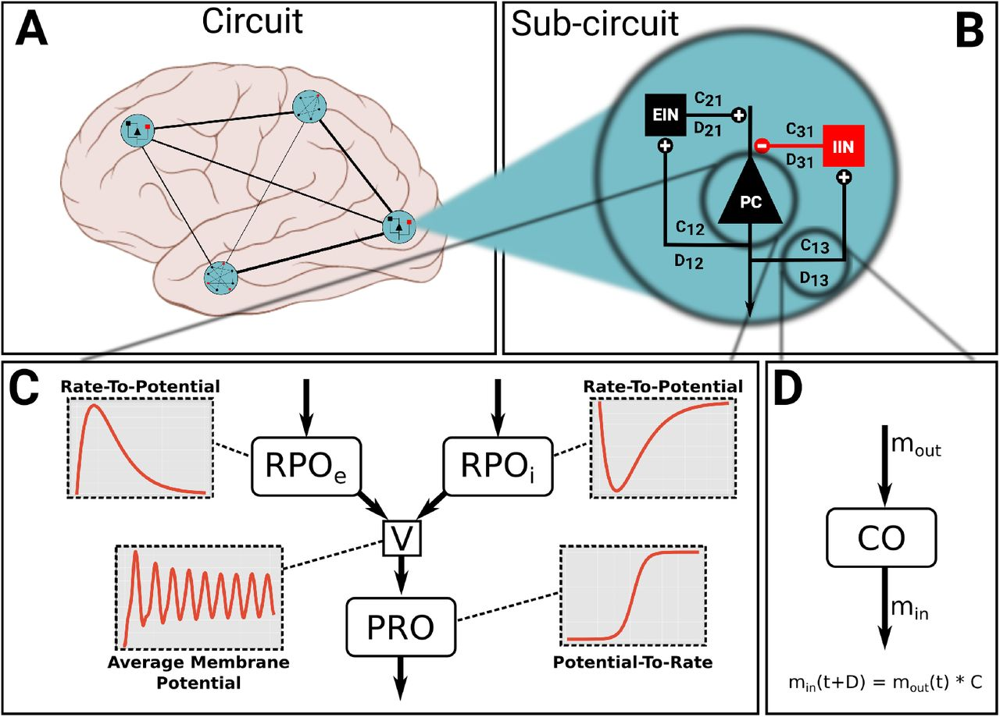

[citation Gast R, Rose D, Salomon C, Möller HE, Weiskopf N, Knösche TR. 2019. PyRates—A Python framework for rate-based neural simulations. PLOS ONE 14:e0225900. doi:10.1371/journal.pone.0225900]

[rightcol 45]


[citation Source Oberlaender et al. <http://www.neuroinformatics2012.org/abstracts/beyond-the-cortical-column-2013-structural-organization-principles-in-rat-vibrissal-cortex.html>]

[endcol]

# Rate-coded and spiking neurons

[leftcol 40]


* **Rate-coded** neurons only represent the instantaneous firing rate of a neuron:

$$
    \tau \, \frac{d v(t)}{dt} + v(t) = \sum_{i=1}^d w_{i, j} \, r_i(t) + b
$$

$$
    r(t) = f(v(t))
$$


{width=100%}

[rightcol 60]

* **Spiking** neurons emit binary spikes when their membrane potential exceeds a threshold (leaky integrate-and-fire, LIF):

$$
    C \, \frac{d v(t)}{dt} = - g_L \, (v(t) - V_L) + I(t)
$$

$$
    \text{if} \; v(t) > V_T \; \text{emit a spike and reset.}
$$


[endcol]


# Several spiking neuron models are possible

[leftcol 40]

* Izhikevich quadratic IF (Izhikevich, 2003).

$$\begin{cases}
    \displaystyle\frac{dv}{dt} = 0.04 \, v^2 + 5 \, v + 140 - u + I \\
    \\
    \displaystyle\frac{du}{dt} = a \, (b \, v - u) \\
\end{cases}$$

[rightcol 55]

* Adaptive exponential IF (AdEx, Brette and Gerstner, 2005).

$$
\begin{cases}
\begin{aligned}
    C \, \frac{dv}{dt} = -g_L \ (v - E_L) + & g_L \, \Delta_T \, \exp(\frac{v - v_T}{\Delta_T}) \\
                                            & + I - w
\end{aligned}\\
\\
    \tau_w \, \displaystyle\frac{dw}{dt} = a \, (v - E_L) - w\\
\end{cases}$$

[endcol]

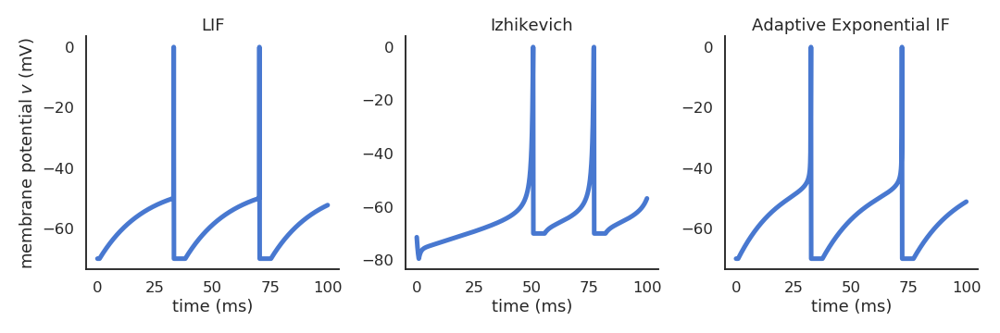

# Realistic neuron models can reproduce a variety of dynamics

[leftcol 65]


[rightcol 35]

* Biological neurons do not all respond the same to an input current.

    * Some fire regularly.

    * Some slow down with time.

    * Some emit bursts of spikes.

* Modern spiking neuron models allow to recreate these dynamics by changing a few parameters.


[endcol]

# Populations of neurons


* Recurrent neural networks (e.g. randomly connected populations of neurons) can exhibit very rich **dynamics** even in the absence of inputs:

[leftcol]


{width=70%}

[rightcol]

* Oscillations at the population level.

* Excitatory/inhibitory balance. 

* Spatio-temporal separation of inputs (**reservoir computing**).

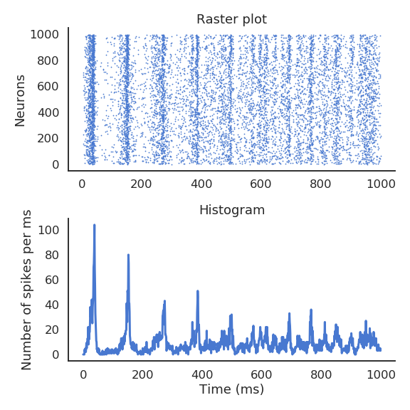{width=70%}

[endcol]


# Synaptic plasticity: Hebbian learning

* **Hebbian learning** postulates that synapses strengthen based on the **correlation** between the activity of the pre- and post-synaptic neurons:

[leftcol 80]

[leftcol 33]

[rightcol 66]

When an axon of cell A is near enough to excite a cell B and repeatedly or persistently takes part in firing it, some growth process or metabolic change takes place in one or both cells such that A’s efficiency, as one of the cells firing B, is increased. 

**Donald Hebb**, 1949

[endcol]

[rightcol 20]

[endcol]

[leftcol 70]

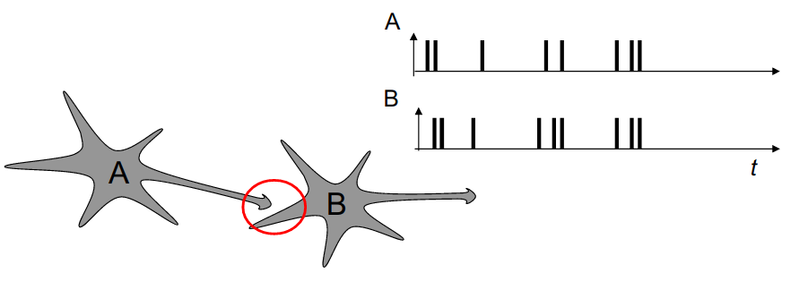

[rightcol 30]

* Weights increase proportionally to the the product of the pre.- and post-synaptic firing rates:

$$\frac{dw}{dt} = \eta \, r^\text{pre} \, r^\text{post}$$

[endcol]

[citation Source: <https://slideplayer.com/slide/11511675/>]

# Synaptic plasticity: Hebbian-based learning

[leftcol 70]


* The **BCM** (Bienenstock, Cooper, and Munro 1982, Intrator and Cooper, 1992) plasticity rule allows LTP and LTD depending on the post-synaptic plasticity:


$$\frac{dw}{dt} = \eta \, r^\text{pre} \, r^\text{post}  \,  (r^\text{post} - \mathbb{E}((r^\text{post})^2))$$

* **Covariance** learning rule:

$$\frac{dw}{dt} = \eta \, r^\text{pre} \, (r^\text{post} - \mathbb{E}(r^\text{post}))$$

* **Oja** learning rule (Oja, 1982):

$$\frac{dw}{dt}= \eta \, r^\text{pre} \, r^\text{post} - \alpha \, (r^\text{post})^2 \, w$$


[rightcol 30]

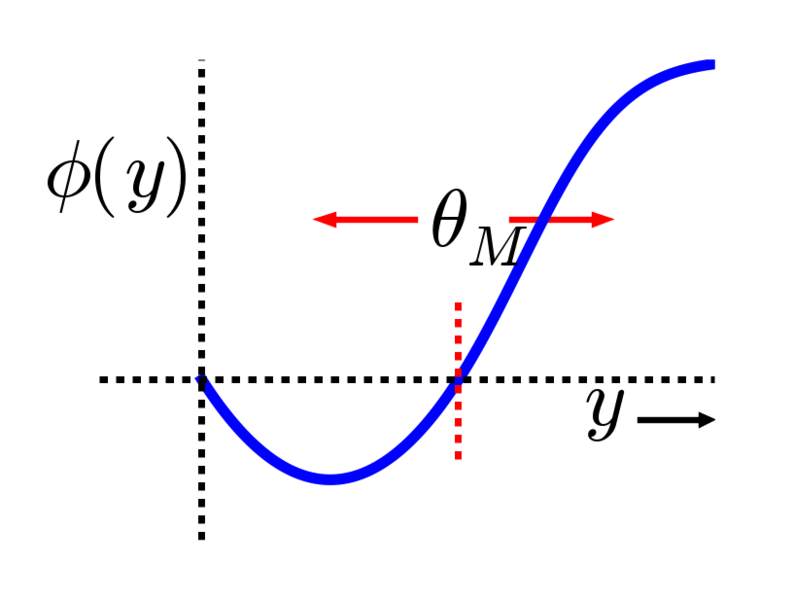

[citation Source: <http://www.scholarpedia.org/article/BCM_theory>]

[endcol]

* Or anything depending only on the pre- and post-synaptic firing rates and possibly neuromodulators, e.g. (Vitay and Hamker, 2010):


$$\begin{aligned}
    \frac{dw}{dt}  & = \eta \, ( \text{DA}(t) - \overline{\text{DA}}) \, (r^\text{post} - \mathbb{E}(r^\text{post}) )^+  \, (r^\text{pre} - \mathbb{E}(r^\text{pre}))- \alpha(t) \,  ((r^\text{post} - \mathbb{E}(r^\text{post} )^+ )^2  \, w
\end{aligned}$$

# STDP: Spike-timing dependent plasticity

* Synaptic efficiencies actually evolve depending on the the **causation** between the neuron's firing patterns:

    * If the pre-synaptic neuron fires **before** the post-synaptic one, the weight is increased (**long-term potentiation**). Pre causes Post to fire.

    * If it fires **after**, the weight is decreased (**long-term depression**). Pre does not cause Post to fire.

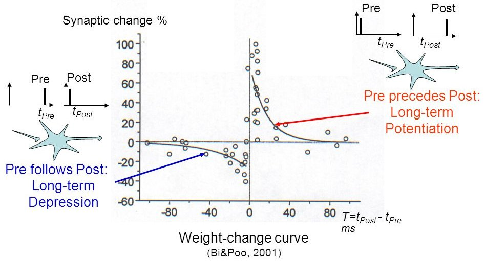{width=70%}

[citation Bi, G. and Poo, M. (2001). Synaptic modification of correlated activity: Hebb's postulate revisited. Ann. Rev. Neurosci., 24:139-166.]

# STDP: Spike-timing dependent plasticity

[leftcol]

* The STDP (spike-timing dependent plasticity) plasticity rule describes how the weight of a synapse evolves when the pre-synaptic neuron fires at $t_\text{pre}$ and the post-synaptic one fires at $t_\text{post}$.

$$ \frac{dw}{dt} = \begin{cases} A^+ \, \exp - \frac{t_\text{pre} - t_\text{post}}{\tau^+} \; \text{if} \; t_\text{post} > t_\text{pre}\\  
    \\
    A^- \, \exp - \frac{t_\text{pre} - t_\text{post}}{\tau^-} \; \text{if} \; t_\text{pre} > t_\text{post}\\ \end{cases}$$

* STDP can be implemented online using traces.

* More complex variants of STDP (triplet STDP) exist, but this is the main model of synaptic plasticity in spiking networks.

[rightcol]


[endcol]

[citation Bi, G. and Poo, M. (2001). Synaptic modification of correlated activity: Hebb's postulate revisited. Ann. Rev. Neurosci., 24:139-166.]


# Neuro-computational modeling

* Populations of neurons can be combined in functional **neuro-computational models** learning to solve various tasks.

* Need to implement one (or more) equations per neuron and synapse (thousands of neurons, millions of synapses..).

[leftcol 70]

[leftcol]

**Basal Ganglia**

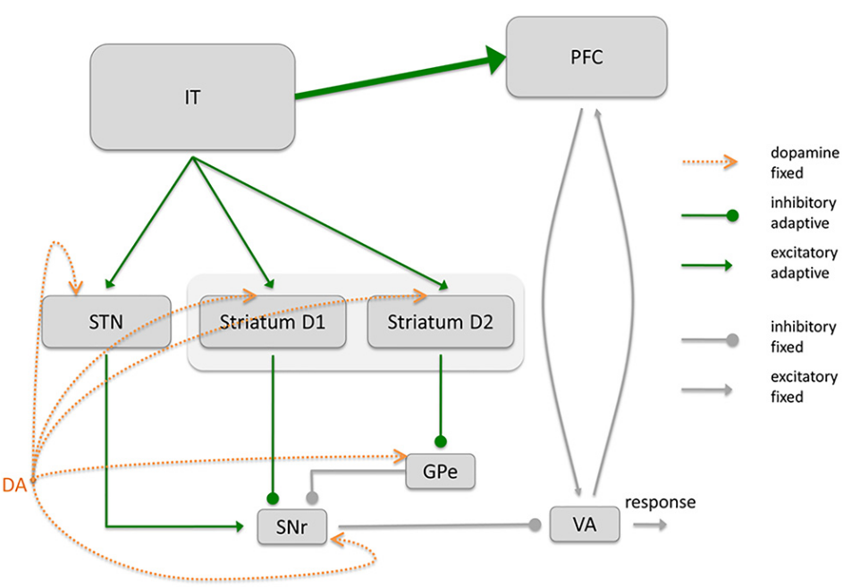

[rightcol]

**Hippocampus**

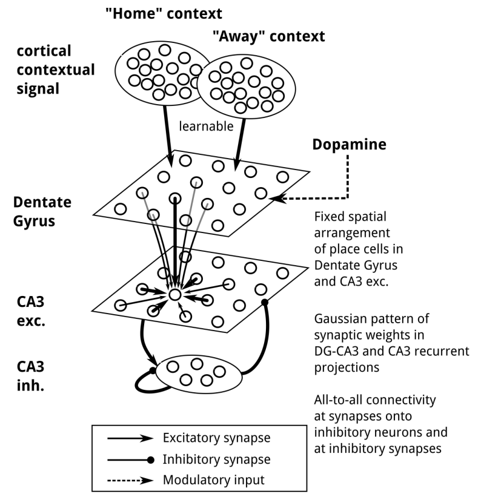{width=80%}


[endcol]

[rightcol 30]

**Dopaminergic system**

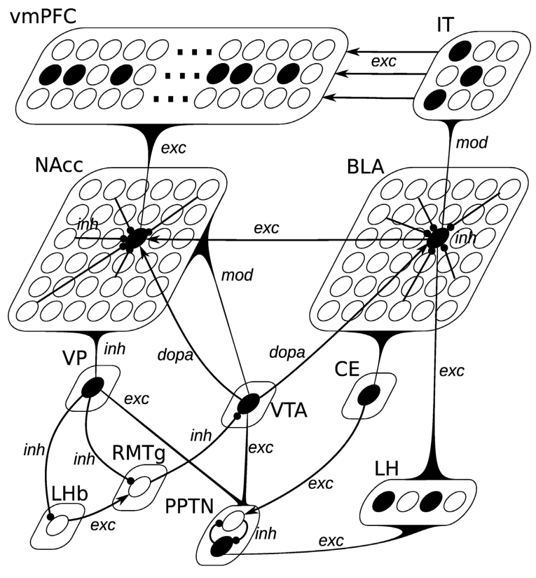


[endcol]


[citation Villagrasa F, Baladron J, Vitay J, Schroll H, Antzoulatos EG, Miller EK, Hamker FH. 2018. On the Role of Cortex-Basal Ganglia Interactions for Category Learning: A Neurocomputational Approach. J Neurosci 38:9551–9562. doi:10.1523/JNEUROSCI.0874-18.2018]


[citation Gönner L, Vitay J, Hamker FH. 2017. Predictive Place-Cell Sequences for Goal-Finding Emerge from Goal Memory and the Cognitive Map: A Computational Model. Frontiers in Computational Neuroscience 11:84–84. doi:10.3389/fncom.2017.00084]


[citation Vitay J, Hamker FH. 2014. Timing and expectation of reward: A neuro-computational model of the afferents to the ventral tegmental area. Frontiers in Neurorobotics 8. doi:10.3389/fnbot.2014.00004]


# 2 - Neuro-simulator ANNarchy


# Neuro-simulators

[leftcol]

**Fixed libraries of models**

* **NEURON** <https://neuron.yale.edu/neuron/>

    * Multi-compartmental models, spiking neurons (CPU)

<!-- * **GENESIS** <http://genesis-sim.org/>

    * Multi-compartmental models, spiking neurons (CPU) -->

* **NEST** <https://nest-initiative.org/>

    * Spiking neurons (CPU)

* **GeNN** <https://genn-team.github.io/genn/>

    * Spiking neurons (GPU)

* **Auryn** <https://fzenke.net/auryn/doku.php>

    * Spiking neurons (CPU)

[rightcol]

**Code generation**

* **Brian** <https://briansimulator.org/>

    * Spiking neurons (CPU)

* **Brian2GeNN** <https://github.com/brian-team/brian2genn>

    * Spiking neurons (GPU)

* **ANNarchy** <https://bitbucket.org/annarchy/annarchy>

    * Rate-coded and spiking neurons (CPU, GPU)

[endcol]

# ANNarchy (Artificial Neural Networks architect)

[leftcol]


[rightcol]


* Source code:

<https://bitbucket.org/annarchy/annarchy>

* Documentation:

<https://annarchy.readthedocs.io/en/stable/>

* Forum:

<https://groups.google.com/forum/#!forum/annarchy>

* Some notebooks used in this tutorial:

<https://github.com/vitay/ANNarchy-notebooks>

[endcol]

[citation Vitay J, Dinkelbach HÜ, Hamker FH. 2015. ANNarchy: a code generation approach to neural simulations on parallel hardware. Frontiers in Neuroinformatics 9. doi:10.3389/fninf.2015.00019]


# Installation

Installation guide: <https://annarchy.readthedocs.io/en/stable/intro/Installation.html>

From pip:

```bash
pip install ANNarchy
```

From source:

```bash
git clone https://bitbucket.org/annarchy/annarchy.git
cd annarchy
python setup.py install
```

Requirements (Linux and MacOS):

* g++/clang++, python 3.5+, numpy, scipy, matplotlib, sympy**!=1.6.1**, cython


# Features

[leftcol]

* Simulation of both **rate-coded** and **spiking** neural networks.

* Only local biologically realistic mechanisms are possible (no backpropagation).

* **Equation-oriented** description of neural/synaptic dynamics (à la Brian).

* **Code generation** in C++, parallelized using OpenMP on CPU and CUDA on GPU (MPI is coming).

* Synaptic, intrinsic and structural plasticity mechanisms.

[rightcol]

{width=100%}

[endcol]

---

{width=100%}

# Structure of a script

```python
from ANNarchy import *

neuron = Neuron(...) # Create neuron types

stdp = Synapse(...) # Create synapse types for transmission and/or plasticity

pop = Population(1000, neuron) # Create populations of neurons

proj = Projection(pop, pop, 'exc', stdp) # Connect the populations
proj.connect_fixed_probability(weights=Uniform(0.0, 1.0), probability=0.1)

compile() # Generate and compile the code

m = Monitor(pop, ['spike']) # Record spikes

simulate(1000.) # Simulate for 1 second

data = m.get('spike') # Retrieve the data and plot it
```

# Rate-coded example : Echo-State Network 

{width=80%}

# Echo-State Network

* ESN rate-coded neurons follow first-order ODEs:

$$
    \tau \frac{dx(t)}{dt} + x(t) = \sum w^\text{in} \, r^\text{in}(t) + g \, \sum w^\text{rec} \, r(t) + \xi(t)
$$

$$
    r(t) = \tanh(x(t))
$$

* Neural dynamics are described by the equation-oriented interface:

```python
from ANNarchy import *

ESN_Neuron = Neuron(
    parameters = """
        tau = 30.0 : population   # Time constant
        g = 1.0 : population      # Scaling
        noise = 0.01 : population # Noise level
    """,
    equations="""
        tau * dx/dt + x = sum(in) + g * sum(exc) + noise * Uniform(-1, 1)  : init=0.0
 
        r = tanh(x)
    """
)
```

# Parameters

```python
    parameters = """
        tau = 30.0 : population   # Time constant
        g = 1.0 : population      # Scaling
        noise = 0.01 : population # Noise level
    """
```

* All parameters used in the equations must be declared in the **Neuron** definition.

* Parameters can have one value per neuron in the population (default) or be common to all neurons (flag `population` or `projection`).

* Parameters and variables are double floats by default, but the type can be specified (`int`, `bool`).

# Variables

```python
    equations="""
        tau * dx/dt + x = sum(in) + g * sum(exc) + noise * Uniform(-1, 1) : init=0.0

        r = tanh(x)
    """
```

* Variables are evaluated at each time step *in the order of their declaration*, except for coupled ODEs.

* Variables can be updated with assignments (`=`, `+=`, etc) or by defining first order ODEs.

* The math C library symbols can be used (`tanh`, `cos`, `exp`, etc).

* Initial values at $t=0$ can be specified with `init` (default: 0.0). Lower/higher bounds on the values of the variables can be set with the `min`/`max` flags:

```
r = x : min=0.0 # ReLU
```

* Additive noise can be drawn from several distributions, including `Uniform`, `Normal`, `LogNormal`, `Exponential`, `Gamma`...


# ODEs

[leftcol]

* First-order ODEs are parsed and manipulated using `sympy`:

```python
    # All equivalent:
    tau * dx/dt + x = I
    tau * dx/dt = I - x
    dx/dt = (I - x)/tau
```

[rightcol]

* The generated C++ code applies a numerical method (fixed step size `dt`) for all neurons:

```python
#pragma omp simd
for(unsigned int i = 0; i < size; i++){
    double _x = (I[i] - x[i])/tau;
    x[i] += dt*_x ;
    r[i] = tanh(x[i]);
}
```

[endcol]

* Several numerical methods are available:

    * Explicit (forward) Euler (default): `tau * dx/dt + x = I : explicit`

    * Implicit (backward) Euler: `tau * dx/dt + x = I : implicit`

    * Exponential Euler (exact for linear ODE): `tau * dx/dt + x = I : exponential`

    * Midpoint (RK2): `tau * dx/dt + x = I : midpoint`

    * Event-driven (spiking synapses): `tau * dx/dt + x = I : event-driven`

[citation <https://annarchy.readthedocs.io/en/stable/manual/NumericalMethods.html>]

# Populations

* Populations are creating by specifying a number of neurons and a neuron type:

```python
pop = Population(1000, ESN_Neuron)
```

* For visualization purposes or when using convolutional layers, a tuple geometry can be passed instead of the size:

```python
pop = Population((100, 100), ESN_Neuron)
```

* All parameters and variables become attributes of the population (read and write) as numpy arrays:

```python
pop.tau = np.linspace(20.0, 40.0, 1000)
pop.r = np.tanh(pop.v)
```

* Slices of populations are called `PopulationView` and can be addressed separately:

```python
pop = Population(1000, ESN_Neuron)
E = pop[:800]
I = pop[800:]
```

# Projections

* Projections connect two populations (or views) in a uni-directional way.

```python
proj_exc = Projection(E, pop, 'exc')
proj_inh = Projection(I, pop, 'inh')
```

* Each target (`'exc', 'inh', 'AMPA', 'NMDA', 'GABA'`) can be defined as needed and will be treated differently by the post-synaptic neurons.

* The weighted sum of inputs for a specific target is accessed in the equations by `sum(target)`:

```python
    equations="""
        tau * dx/dt + x = sum(exc) - sum(inh)

        r = tanh(x)
    """
```

* It is therefore possible to model modulatory effects, divisive inhibition, etc.

# Connection methods

* Projections must be populated with a connectivity matrix (who is connected to who), a weight `w` and optionally a delay `d` (uniform or variable).

* Several patterns are predefined:

```python
proj.connect_all_to_all(weights=Normal(0.0, 1.0), delays=2.0, allow_self_connections=False)
proj.connect_one_to_one(weights=1.0, delays=Uniform(1.0, 10.0))
proj.connect_fixed_number_pre(number=20, weights=1.0)
proj.connect_fixed_number_post(number=20, weights=1.0)
proj.connect_fixed_probability(probability=0.2, weights=1.0)
proj.connect_gaussian(amp=1.0, sigma=0.2, limit=0.001)
proj.connect_dog(amp_pos=1.0, sigma_pos=0.2, amp_neg=0.3, sigma_neg=0.7, limit=0.001)
```

* But you can also load Numpy arrays or Scipy sparse matrices. Example for synfire chains:

[leftcol]

```python
w = np.array([[None]*pre.size]*post.size)
for i in range(post.size):
    w[i, (i-1)%pre.size] = 1.0
proj.connect_from_matrix(w)
```

[rightcol]

```python
w = lil_matrix((pre.size, post.size))
for i in range(pre.size):
    w[pre.size, (i+1)%post.size] = 1.0
proj.connect_from_sparse(w)
```

[endcol]

# Compiling and running the simulation

* Once all populations and projections are created, you have to generate to the C++ code and compile it:

```python
compile()
```

* You can now manipulate all parameters/variables from Python thanks to the Cython bindings.

* A simulation is simply run for a fixed duration with:

```python
simulate(1000.) # 1 second
```

* You can also run a simulation until a criteria is filled, check:

<https://annarchy.readthedocs.io/en/stable/manual/Simulation.html#early-stopping>

# Monitoring

* By default, a simulation is run in C++ without interaction with Python.

* You may want to record some variables (neural or synaptic) during the simulation with a `Monitor`:

```python
m = Monitor(pop, ['v', 'r'])
n = Monitor(proj, ['w'])
```

* After the simulation, you can retrieve the recordings with:

```python
recorded_v = m.get('v')
recorded_r = m.get('r')
recorded_w = n.get('w')
```

* Warning: calling `get()` flushes the array.

* Warning: recording projections can quickly fill up the RAM...

# Example 1: Echo-State Network

Link to the Jupyter notebook on github: [RC.ipynb](https://github.com/vitay/ANNarchy-notebooks/blob/master/notebooks/RC.ipynb)

{width=80%}

# Spiking neurons

[leftcol 45]

* Spiking neurons must also define two additional fields:

    * `spike`: condition for emitting a spike.

    * `reset`: what happens after a spike is emitted (at the start of the refractory period).

* A refractory period in ms can also be specified.

{width=100%}

[rightcol 55]

* Example of the Leaky Integrate-and-Fire:

$$
    C \, \frac{d v(t)}{dt} = - g_L \, (v(t) - V_L) + I(t)
$$

$$
    \text{if} \; v(t) > V_T \; \text{emit a spike and reset.}
$$


```python
LIF = Neuron(
    parameters="""
        C = 200.
        g_L = 10.
        E_L = -70.
        v_T = 0.
        v_r = -58.
        I = 0.25
    """,
    equations="""
        C*dv/dt = g_L*(E_L - v) + I : init=E_L     
    """,
    spike=" v >= v_T ",
    reset=" v = v_r ",
    refractory = 2.0
)
```

[endcol]

# Conductances / currents

[leftcol 60]

* A pre-synaptic spike arriving to a spiking neuron increases the conductance/current `g_target` (e.g. `g_exc` or `g_inh`, depending on the projection).

```python
LIF = Neuron(
    parameters="...",
    equations="""
        C*dv/dt = g_L*(E_L - v) + g_exc : init=E_L    
    """,
    spike=" v >= v_T ",
    reset=" v = v_r ",
    refractory = 2.0
)
```

* Each spike increments instantaneously `g_target` from the synaptic efficiency `w` of the corresponding synapse.

```
g_target += w
```

[rightcol 40]


[endcol]

# Conductances / currents

[leftcol 60]

* For **exponentially-decreasing** or **alpha-shaped** synapses, ODEs have to be introduced for the conductance/current.

* The exponential numerical method should be preferred, as integration is exact.

```python
LIF = Neuron(
    parameters="...",
    equations="""
        C*dv/dt = g_L*(E_L - v) + g_exc : init=E_L   

        tau_exc * dg_exc/dt = - g_exc : exponential
    """,
    spike=" v >= v_T ",
    reset=" v = v_r ",
    refractory = 2.0
)
```


[rightcol 40]


[endcol]


# Example 2: COBA - Conductance-based E/I network

Link to the Jupyter notebook on github: [COBA.ipynb](https://github.com/vitay/ANNarchy-notebooks/blob/master/notebooks/COBA.ipynb)

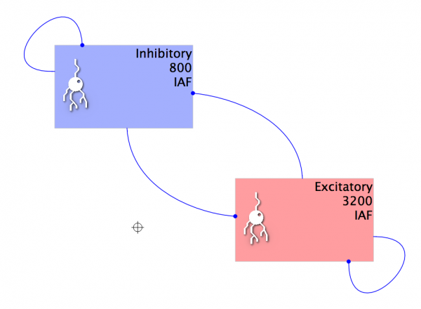{width=60%}


$$\tau \cdot \frac{dv (t)}{dt} = E_l - v(t) + g_\text{exc} (t) \, (E_\text{exc} - v(t)) + g_\text{inh} (t) \, (E_\text{inh} - v(t)) + I(t)$$


# Rate-coded synapses : Intrator & Cooper BCM learning rule

* Synapses can also implement plasticity rules that will be evaluated after each neural update.

$$\Delta w = \eta \, r^\text{pre} \, r^\text{post}  \,  (r^\text{post} - \mathbb{E}((r^\text{post})^2))$$

```python
IBCM = Synapse(
    parameters = """
        eta = 0.01 : projection
        tau = 2000.0 : projection
    """,
    equations = """
        tau * dtheta/dt + theta = post.r^2 : postsynaptic, exponential

        dw/dt = eta * post.r * (post.r - theta) * pre.r : min=0.0, explicit
    """,
    psp = " w * pre.r"
)
```

* Each synapse can access pre- and post-synaptic variables with `pre.` and `post.`.

* The `postsynaptic` flag allows to do computations only once per post-synaptic neurons.

* `psp` optionally defines what will be summed by the post-synaptic neuron (e.g. `psp = "w * log(pre.r)"`).

# Plastic projections

* The synapse type just has to be passed to the Projection:

```python
proj = Projection(inp, pop, 'exc', IBCM)
```

* Synaptic variables can be accessed as lists of lists for the whole projection:

```python
proj.w
proj.theta
```

or for a single post-synaptic neuron:

```python
proj[10].w
```

# Spiking synapses : Example of Short-term plasticity (STP)

* Spiking synapses can define a `pre_spike` field, defining what happens when a pre-synaptic spike arrives at the synapse.

* `g_target` is an alias for the corresponding post-synaptic conductance: it will be replaced by `g_exc` or `g_inh` depending on how the synapse is used.

* By default, a pre-synaptic spike increments the post-synaptic conductance from `w`: `g_target += w`

```python
STP = Synapse(
    parameters = """
        tau_rec = 100.0 : projection
        tau_facil = 0.01 : projection
        U = 0.5
    """,
    equations = """
        dx/dt = (1 - x)/tau_rec : init = 1.0, event-driven
        du/dt = (U - u)/tau_facil : init = 0.5, event-driven
    """,
    pre_spike="""
        g_target += w * u * x
        x *= (1 - u)
        u += U * (1 - u)
    """
)
```

# Spiking synapses : Example of Spike-Timing Dependent plasticity (STDP)

* `post_spike` similarly defines what happens when a post-synaptic spike is emitted.

```python
STDP = Synapse(
    parameters = """
        tau_plus = 20.0 : projection ; tau_minus = 20.0 : projection
        A_plus = 0.01 : projection   ; A_minus = 0.01 : projection
        w_min = 0.0 : projection     ; w_max = 1.0 : projection
    """,
    equations = """
        tau_plus  * dx/dt = -x : event-driven # pre-synaptic trace
        tau_minus * dy/dt = -y : event-driven # post-synaptic trace
    """,
    pre_spike="""
        g_target += w
        x += A_plus * w_max
        w = clip(w + y, w_min , w_max)
    """,
    post_spike="""
        y -= A_minus * w_max
        w = clip(w + x, w_min , w_max)
    """)
```

# Example 3: STDP

Link to the Jupyter notebook on github: [STDP.ipynb](https://github.com/vitay/ANNarchy-notebooks/blob/master/notebooks/STDP.ipynb)

$$\tau^+ \, \frac{d x(t)}{dt} = -x(t)$$
$$\tau^- \, \frac{d y(t)}{dt} = -y(t)$$

[leftcol]

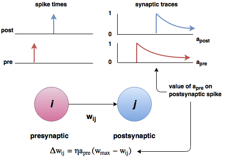

[rightcol]

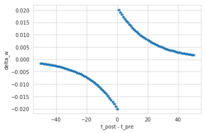

[endcol]

# And much more...

* Standard populations (`SpikeSourceArray`, `TimedArray`, `PoissonPopulation`, `HomogeneousCorrelatedSpikeTrains`), OpenCV bindings.

* Standard neurons:

    * LeakyIntegrator, Izhikevich, IF_curr_exp, IF_cond_exp, IF_curr_alpha, IF_cond_alpha, HH_cond_exp, EIF_cond_exp_isfa_ista, EIF_cond_alpha_isfa_ista

* Standard synapses:

    * Hebb, Oja, IBCM, STP, STDP

* Parallel simulations with `parallel_run`.

* Convolutional and pooling layers.

* Hybrid rate-coded / spiking networks.

* Structural plasticity.

* Tensorboard visualization.

RTFD: <https://annarchy.readthedocs.io>

# References

* Bi, G. Q. and Poo, M. M. (1998). Synaptic modifications in cultured Hippocampal neurons: dependence on spike timing, synaptic strength, and postsynaptic cell type. J Neurosci, 18:10464-72.

* Bienenstock, E. L., Cooper, L. N, and Munro, P. W. (1982). Theory for the development of neuron selectivity: orientation specificity and binocular interaction in visual cortex. Journal of Neuroscience, 2:32–48.

* Brette R. and Gerstner W. (2005), Adaptive Exponential Integrate-and-Fire Model as an Effective Description of Neuronal Activity, J. Neurophysiol. 94: 3637 - 3642.

* Intrator, N. and Cooper, L. N (1992). Objective function formulation of the BCM theory of visual cortical plasticity: Statistical connections, stability conditions. Neural Networks, 5:3–17.

* Izhikevich EM. 2003. Simple model of spiking neurons. IEEE transactions on neural networks / a publication of the IEEE Neural Networks Council 14:1569–72. doi:10.1109/TNN.2003.820440

* Oja E. 1982. A simplified neuron model as a principal component analyze. J Math Biol 15:267–273.

* Vitay J, Hamker FH. 2010. A computational model of Basal Ganglia and its role in memory retrieval in rewarded visual memory tasks. Frontiers in computational neuroscience 4. doi:10.3389/fncom.2010.00013

